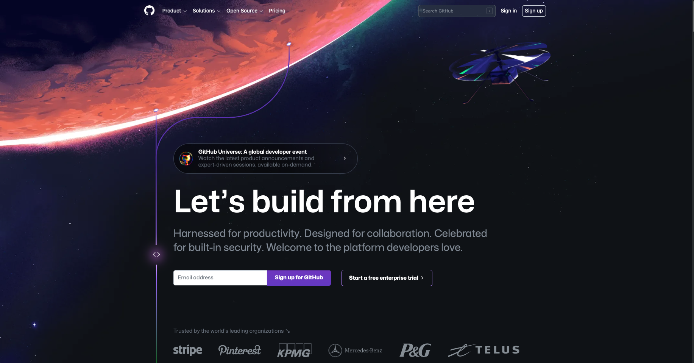

# Double
*Initial ideas*

 

* double.muntjac.io
* No ads
* Host on AWS (free trial) or what about github pages (free) - ask Hayden?
* A game to keep your mental maths sharp

 

* Allow 1h labs work on a Sunday (easy upskill time, during meals) running up to OP JINGLE
* Smash out a beta release by EOY (OP JINGLE)
* Spend 1h each Saturday AM to get a proper stable release out (Easter?)

 

* MVP:
    * Randomly generated 7 questions - mental maths problems - to challenge your thinking and keep you sharp
    * Provide a standard - challenging, progressive (use a cookie to track progression - globle-like?)
    * It is expected that you get them right, what you want to do is do it faster perhaps
    * No time limit, or stick 2 mins on it? or perhaps the goal is to do it as quick as possible
* Future iteration: backend with users...

    5 + 17 = 22
    7 * 101 = 707
    123 / 3 = 41
    764 - 98 = 666
    76 * 4 = 304
    34 + 55 = 89
    34 * 78 = 2662

Like worldle teaches you to memorise something visual, double should do the same.
The mappings between the numbers - if you memorise this, mental maths becomes straightforward
Take 1 to 5 for example as the range, take the number 4:
4 + 1 = 5
4 + 2 = 6
4 + 3 = 7
4 + 4 = 8
4 + 5 = 9
4 - 1 = 3
4 - 2 = 2
4 - 3 = 1
4 - 4 = 0
4 - 5 = -1
4 * 1 = 4
4 * 2 = 8
4 * 3 = 12
4 * 4 = 16
4 * 5 = 20
4 / 1 = 4
4 / 2 = 2
Every number in the range maps to every other number in the range
This is represented by graphs
y = x + 4
y = x - 4
y = 4x
y = x/4

 

* Design:
    * See sheet on paper
    * Github (logged out) main page is an excellent standard

 

 

* Desmos Tab? | like intelliJ services? or VS Code terminal
https://www.desmos.com/api/v1.7/docs/examples/parabola.html
https://www.desmos.com/api/v1.7/docs/index.html

https://www.color-hex.com/color-palette/98179
https://draculatheme.com/contribute

https://atlassian.design/foundations/color
https://atlassian.design/foundations/color-new/color-palette-new/

STARS:
blue shifted stars are even, red shifted are odd; the bigger the star the smaller the number (20% diiference, symbolises distance away), primes are brown dwarfs, multiples of 5 are red giants, multiples of 10 are neutron stars

6-12px star variance (random)?
Even: blue
Odd: red
primes: brown
5's: red giant
10's: neutrons

-------

CSS night skies:

https://codepen.io/sweaver2112/pen/QWbvOMK

https://codepen.io/interaminense/full/QyGbXL/

No longer constellation, rather star system cluster:
with each star reprents an x value and the planets representing y's (answers)

Sack off Desmos integration; inappropriate...

----

OP JINGLE DOUBLE MVP:

TUES 27th: 
* Task planning
* Requirements Gathering
* Project Set Up, including TC & Nexus
* Research into Wordle
* Any more design
* Test set up (AMAP)

First 2h block: Create Angular, Set up Nexus and TC, Set up technical docs
Second 2h block: Research Worldle 1h, Create UI design doc 1h
Third 2h block: Gather Requirements (req doc, MOSCOW) 1h, Define Cypress e2e tests 1h